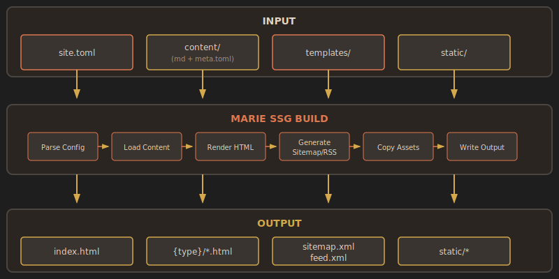
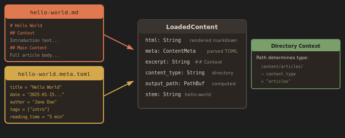
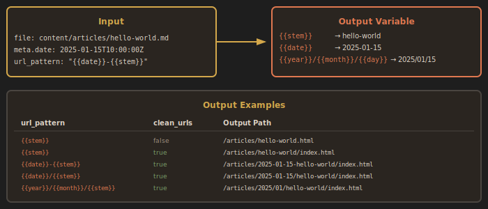
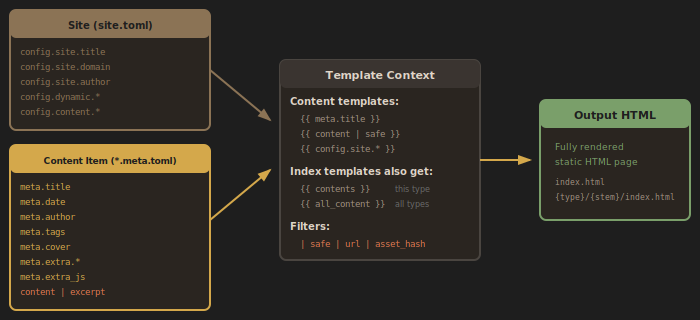
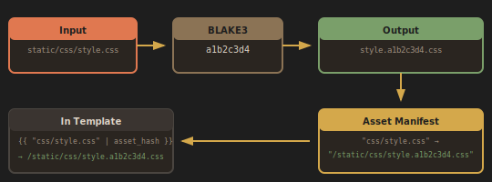
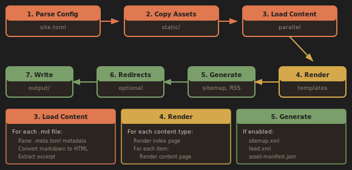

# Marie SSG Data Flow

This document describes how Marie SSG transforms input files into a static website.

## Overview

Marie SSG follows a pipeline architecture: parse configuration, load content in parallel, render through templates, and write output files.



---

## Content File Pairing

Each content item consists of two paired files that share a base name:



### File Pair Structure

For a content item named `hello-world`:

| File                    | Purpose                                   |
| ----------------------- | ----------------------------------------- |
| `hello-world.md`        | Markdown content body                     |
| `hello-world.meta.toml` | TOML metadata (title, date, author, tags) |

### Directory Determines Type

The parent directory name becomes the `content_type`:

- `content/articles/` → content_type = `articles`
- `content/projects/` → content_type = `projects`

---

## URL Pattern System

The `url_pattern` configuration controls how output paths are generated from input files.



### Available Placeholders

| Placeholder | Source                     | Example       |
| ----------- | -------------------------- | ------------- |
| `{stem}`    | Filename without extension | `hello-world` |
| `{date}`    | meta.date (YYYY-MM-DD)     | `2025-01-15`  |
| `{year}`    | meta.date year             | `2025`        |
| `{month}`   | meta.date month            | `01`          |
| `{day}`     | meta.date day              | `15`          |

### Pattern Examples

| Pattern                 | Output with `clean_urls=true`                 |
| ----------------------- | --------------------------------------------- |
| `{stem}`                | `/articles/hello-world/index.html`            |
| `{date}-{stem}`         | `/articles/2025-01-15-hello-world/index.html` |
| `{year}/{month}/{stem}` | `/articles/2025/01/hello-world/index.html`    |

---

## Template Context

Templates receive variables from multiple sources that can be used with Jinja-style syntax.



### Available in All Templates

- `{{ meta.title }}`, `{{ meta.date }}`, `{{ meta.author }}` — from meta.toml
- `{{ content | safe }}` — rendered HTML from .md file
- `{{ excerpt }}` — extracted from `## Context` section
- `{{ config.site.* }}` — site configuration values

### Additional for Index Templates

- `{{ contents }}` — list of items for this content type
- `{{ all_content }}` — list of all content items across all types

### Template Filters

| Filter       | Purpose                      |
| ------------ | ---------------------------- |
| `safe`       | Output HTML without escaping |
| `url`        | Convert to URL-safe format   |
| `asset_hash` | Resolve hashed asset path    |

---

## Asset Hashing

When `asset_hashing_enabled = true`, static assets (CSS, JS) receive content-based hash suffixes for cache busting.



### How It Works

1. **Read** the original asset file (`style.css`)
2. **Hash** the content using BLAKE3 (first 8 characters)
3. **Write** the hashed filename (`style.a1b2c3d4.css`)
4. **Record** the mapping in asset manifest

### Using in Templates

```jinja
<link href="{{ 'css/style.css' | asset_hash }}" rel="stylesheet">
```

Outputs: `/static/css/style.a1b2c3d4.css`

---

## Build Pipeline

The build process runs through seven stages:



### Stage Details

| Stage           | Description                                             |
| --------------- | ------------------------------------------------------- |
| 1. Parse Config | Read `site.toml` and build configuration                |
| 2. Copy Assets  | Copy `static/` to output with optional hashing          |
| 3. Load Content | Read all `.md` and `.meta.toml` files (parallel)        |
| 4. Render       | Apply templates to generate HTML pages                  |
| 5. Generate     | Create `sitemap.xml`, `feed.xml`, `asset-manifest.json` |
| 6. Redirects    | Generate redirect pages if configured                   |
| 7. Write Output | Write all files to disk                                 |

### Output Structure

The final output directory contains:

- `index.html` — Site homepage
- `{type}/index.html` — Index page for each content type
- `{type}/{stem}/index.html` — Individual content pages (with `clean_urls`)
- `sitemap.xml` — XML sitemap for search engines
- `feed.xml` — RSS 2.0 feed
- `static/` — Copied static assets (optionally with hash suffixes)
