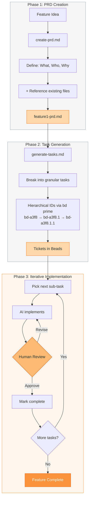

**The Idea**

- Break down complex features into structured, verifiable steps rather than monolithic AI requests
- Guide the AI step-by-step with built-in checkpoints for human review

**Three-Phase Workflow**

1. **PRD (Product Requirements Document) Creation** (`create-prd.md`)
   - Define what you're building, for whom, and why
   - Feed the AI your feature description + optionally reference existing files for context
   - Output: `tasks/prd-[kebab-case-feature-name]-[YYYY-MM-DD].md`

1. **Task Generation** (`generate-tasks.md`)
   - Take the PRD and break it into granular, actionable tasks with sub-tasks
   - Use 'bd' for task tracking (tool: bd prime)
     - Beads supports hierarchical IDs for epics:
       - bd-a3f8 (Epic)
       - bd-a3f8.1 (Task)
       - bd-a3f8.1.1 (Sub-task)
   - Creates a implementation roadmap (bd-a3f8, bd-a3f8.1, etc.)
   - Output: tickets in beads (tool: bd prime)

1. **Iterative Implementation** (`execute-task.md`)
   - Work through tasks one sub-task at a time
   - The task result is a pull request
   - The task runs in a Docker container
   - Agent completes a sub-task → you review/approve → move to next
   - On merge to main executes project manager role with the task to verify task completion and close the resolved tickets

**Key Principles**

- Small, digestible chunks reduce AI errors
- Human verification at each step maintains control
- Clear progress visibility via task completion markers

